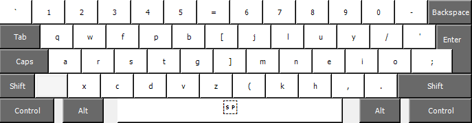
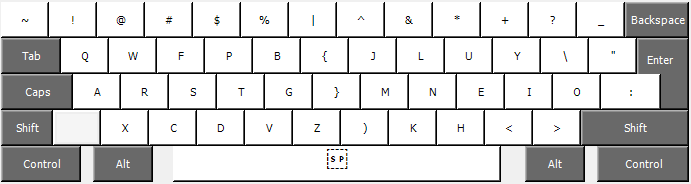

# Colemak mod dh wide for an ANSISO keyboard

These are the custom settings of my colemak mod dh (wide) layout variant for programming. The layout is an hybrid between an ANSI and an ISO/OSI layout (called ANSISO). I am currently using a [Logitech G915](https://www.logitechg.com/en-us/products/gaming-keyboards/g915-low-profile-wireless-mechanical-gaming-keyboard.html) keyboard.

Yes, this is just for myself.  
No, this is not an official mod.  
No, publishing the setting doesn't mean that you will like them / be comfortable using them.  

## What did I change
It is basically the mod dh wide variant but with some keys swapped:

* Instead of the ''/'' key, I use the ''(''. The same thing applies if the "Shift'' key is pressed. Instead of the ''?'', I prefer the '')''. I can now control every single parenthesis with the keys that are in the center of the keyboard (by using an IDE the parenthesis will be closed automatically, so you do not even need to press the ''Shift'' key at all);
* The '';'' and the '':'' are now next to the ''o'' key;
* Instead of the '';'' and the '':'' key, we have the ''/'' and the ''\\'' key;
* Right next to the ''/'' and the ''\\'' key, there is the single and double quotation mark key;
* Instead of the ''+'' key, now we have the ''|'' key. All the mathematical operators (except for the ''/'') can be accessed by pressing ''Shift'' and a number (look at the images below to know which number).

## The keyboard layout

The layout:

  

The layout with the ''Shift'' key pressed:

  

## How to use it
You have to download Microsoft Keyboard Layout Creator (you can find the link [here](https://www.microsoft.com/en-us/download/details.aspx?id=102134)).  
After installing it, load the source file (KLC extension) and build the DLL and the setup package.

## Original layout

If you want to know more about the Colemak mod dh wide layout, you will find everything you need at [this link](https://colemakmods.github.io/mod-dh/keyboards.html).

## TODO
* Maybe it could be better to use the Programmer Dvorak's layout for the numbers? (even if it is against the ''rolling over keys'' mindset). 
